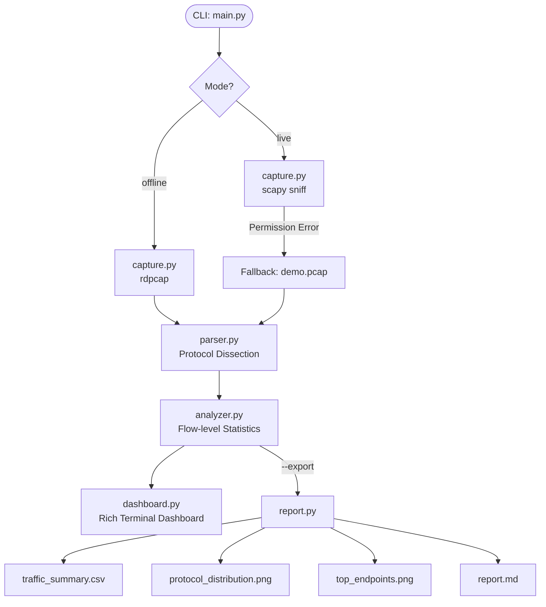

# 即時封包監測與流量統計系統

**Real-time Packet Monitoring and Traffic Statistics System**

> 一個模組化、跨平台的網路封包分析工具，支援離線 `.pcap` 分析與即時網路擷取，
> 並整合終端機儀表板、流量統計圖表及 Markdown 成果報告輸出。

---

## 📋 專案簡介

本系統是一個以 **Python 3** 開發的學術型網路監測工具，結合 *protocol dissection*、
*flow-level statistics* 與 *real-time packet inspection* 等核心技術，
實現 *lightweight network observability*。

系統設計為雙模式運作：

| 模式 | 說明 |
|------|------|
| **Offline（離線）** | 讀取 `.pcap` 封包記錄檔進行完整 *traffic profiling* |
| **Live（即時）** | 嘗試從指定網路介面即時擷取；若權限不足則優雅 fallback |

---

## ✨ 功能特色

- 🔍 **Protocol Dissection**：支援 Ethernet / IPv4 / TCP / UDP / ICMP / DNS / HTTP
- 📊 **Flow-level Statistics**：總封包數、總位元組數、PPS、協定分布、Top IP、Top Port
- 🖥️ **Rich 終端機儀表板**：彩色表格與摘要面板，提供即時可視化
- 📈 **圖表輸出**：協定分布圓餅圖 + Top Endpoint 長條圖（PNG）
- 📄 **Markdown 報告**：學術格式成果摘要，適合書審成果集
- 💾 **CSV 匯出**：完整封包層級資料，可再分析
- 🛡️ **Graceful Fallback**：live capture 失敗時顯示友善訊息，不崩潰
- 🎭 **Demo 模式**：自動生成合成 demo.pcap，無須真實流量即可展示

---

## 🏗️ 系統架構

```
packet-monitor/
├── main.py              # CLI 入口（argparse）
├── requirements.txt     # Python 依賴清單
├── README.md
├── sample_data/
│   └── demo.pcap        # 自動生成的合成封包檔
├── output/              # 輸出目錄
│   ├── traffic_summary.csv
│   ├── protocol_distribution.png
│   ├── top_endpoints.png
│   └── report.md
├── src/
│   ├── __init__.py
│   ├── capture.py       # 封包擷取：offline pcap + live sniff
│   ├── parser.py        # Protocol dissection → ParsedPacket dataclass
│   ├── analyzer.py      # 統計彙整 → pandas DataFrame + stats dict
│   ├── dashboard.py     # Rich 終端機儀表板
│   ├── report.py        # CSV / PNG / Markdown 輸出
│   └── utils.py         # 共用工具函式
└── tests/
    └── test_analyzer.py # pytest 單元測試
```

### 系統流程圖（Mermaid）



---

## 🛠️ 安裝方式

### 前置需求

- Python 3.11+
- （Linux/macOS live capture）需要 `libpcap`：`sudo apt install libpcap-dev`
- （Windows live capture）需要 [Npcap](https://npcap.com/)

### 安裝步驟

```bash
# 1. 複製專案
git clone https://github.com/TeWei02/packet-monitor.git
cd packet-monitor

# 2. 建立虛擬環境（建議）
python -m venv venv
source venv/bin/activate      # Linux/macOS
# venv\Scripts\activate       # Windows

# 3. 安裝相依套件
pip install -r requirements.txt
```

---

## 🚀 執行範例

### Demo 模式（最快上手，無須任何 pcap）

```bash
python main.py --demo
```

自動生成 `sample_data/demo.pcap` 並執行完整分析。

### 離線分析模式

```bash
# 基本分析
python main.py --mode offline --pcap sample_data/demo.pcap

# 分析並匯出全部報告
python main.py --mode offline --pcap sample_data/demo.pcap --export

# 僅分析前 100 個封包
python main.py --mode offline --pcap sample_data/demo.pcap --limit 100
```

### 即時擷取模式

```bash
# Linux / macOS（需要 root）
sudo python main.py --mode live --iface eth0 --limit 200

# Windows（以系統管理員身份執行）
python main.py --mode live --iface "Wi-Fi" --limit 200

# 不指定介面（Scapy 自動選擇）
sudo python main.py --mode live
```

若權限不足，系統將自動 fallback 至 demo.pcap，不會崩潰。

### 單元測試

```bash
python -m pytest tests/ -v
```

---

## 📤 輸出說明

匯出後（`--export`）可在 `output/` 目錄找到以下檔案：

| 檔案 | 說明 |
|------|------|
| `traffic_summary.csv` | 完整封包層級統計資料（可用 Excel / pandas 繼續分析） |
| `protocol_distribution.png` | 協定分布圓餅圖 |
| `top_endpoints.png` | Top Source / Destination IP 長條圖 |
| `report.md` | Markdown 格式學術分析報告摘要 |

---

## 🔬 技術亮點

| 技術 | 應用說明 |
|------|----------|
| **Scapy** | Protocol dissection，逐層解析 Ethernet→IP→TCP/UDP/ICMP/DNS |
| **Rich** | 終端機彩色儀表板，即時呈現 real-time packet inspection 結果 |
| **pandas** | Flow-level statistics 彙整，高效處理大量封包資料 |
| **Matplotlib** | 靜態統計圖表輸出，適合報告嵌入 |
| **dataclass** | 強型別 `ParsedPacket`，確保 traffic profiling 資料一致性 |
| **argparse** | 彈性 CLI 設計，支援多種執行情境 |

---

## 🔭 可延伸方向

1. **異常偵測**：整合 IP flood / port scan detection 規則引擎
2. **Web UI**：使用 FastAPI + WebSocket 實現瀏覽器端即時儀表板
3. **長期儲存**：對接 Elasticsearch + Kibana 進行歷史流量趨勢分析
4. **IPv6 支援**：擴充 parser.py 解析 IPv6 標頭
5. **深度封包檢測**：整合 Zeek 或 Suricata 進行 payload-level 分析
6. **封包重組**：實作 TCP stream reassembly，支援完整 HTTP body 解析

---

## ⚠️ 已知限制

- Live capture 需要 root / Administrator 權限。
- Scapy 在 Windows 上可能需要 Npcap；如安裝困難可改用 pyshark。
- 本系統僅解析 IPv4；IPv6 封包標記為 `OTHER`，尚未完整支援。
- 合成 demo.pcap 為隨機生成，不代表真實網路特徵。

---

## 📚 參考資料

- [Scapy Documentation](https://scapy.readthedocs.io/)
- [Rich Documentation](https://rich.readthedocs.io/)
- [pandas Documentation](https://pandas.pydata.org/docs/)
- [Wireshark Sample Captures](https://wiki.wireshark.org/SampleCaptures)

---

*Made with ❤️ for academic project demonstration.*