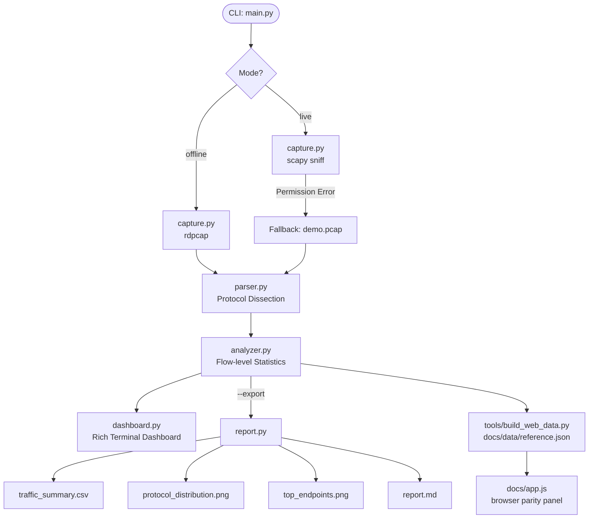

# Real-time Packet Monitoring and Traffic Statistics System

**即時封包監測與流量統計系統**

[Live console](https://tewei02.github.io/Real-time-Packet-Monitoring-and-Traffic-Statistics-System/) · [Repository](https://github.com/TeWei02/Real-time-Packet-Monitoring-and-Traffic-Statistics-System) · MIT licensed · Python 3.11+

---

## 🚀 Live demo

A self-contained browser build of the analyser is published at:

**https://tewei02.github.io/Real-time-Packet-Monitoring-and-Traffic-Statistics-System/**

Press **Analyse bundled capture** on that page. The browser reader dissects the bundled
200-packet capture in JavaScript and then diffs its own numbers against the output of the
Python pipeline (`docs/data/reference.json`). The *Cross-check against the Python pipeline*
panel lists every quantity compared and reports **17/17 checks passed** for the bundled
capture — the same 200 packets, 4 protocols (TCP 80, UDP 48, DNS 45, ICMP 27), identical
protocol counts and totals.

The console offers three inputs and the same reporting path for each:

| Input | What it does |
|-------|--------------|
| Bundled capture | Dissects `docs/data/demo.pcap` and cross-checks it against the Python reference. |
| Upload `.pcap` | Reads a classic libpcap file **locally in your browser**; nothing is transmitted or stored. |
| Synthetic stream | Generates a seeded simulated dataset in the browser, labelled *simulated* in the interface and in the exported report. |

It also renders the protocol donut, the top-destination bars and the packet-rate line chart,
shows the dissected packet table with a text filter, exports CSV and a Markdown report, and
registers a service worker so the page works offline and can be installed to a home screen.

### Honest labelling

- The 200 packets in `docs/data/demo.pcap` are **synthetic**, generated by this project's own
  demo generator. Addresses, ports and DNS names are fabricated.
- The *synthetic stream* button produces a **further simulated** dataset from a fixed seed. It
  is not a capture and no traffic was measured from a live network.
- Uploaded files are parsed locally in the browser; no data leaves the machine.
- No measurement results, participant counts or field-trial data are reported anywhere in this
  project; the statistics shown are exactly the properties of the capture being analysed.

---

## 🚀 Quick Start (local)

> **No root access or special hardware required.**  A single command generates a synthetic
> capture, runs the full analysis pipeline, and exports all results to `./output/`.

**Linux / macOS**
```bash
git clone https://github.com/TeWei02/Real-time-Packet-Monitoring-and-Traffic-Statistics-System.git
cd Real-time-Packet-Monitoring-and-Traffic-Statistics-System
bash run_demo.sh
```

**Windows**
```
git clone https://github.com/TeWei02/Real-time-Packet-Monitoring-and-Traffic-Statistics-System.git
cd Real-time-Packet-Monitoring-and-Traffic-Statistics-System
run_demo.bat
```

Or, if you already have Python 3.11+ and the dependencies installed:
```bash
python main.py --demo --export
```

Expected outputs in `./output/`:

| File | Description |
|------|-------------|
| `traffic_summary.csv` | Packet-level dataset (200 rows) |
| `protocol_distribution.png` | Protocol composition pie chart |
| `top_endpoints.png` | Top source / destination bar chart |
| `report.md` | Markdown analysis summary |

---

## Project Overview

This is a network and communication engineering project written entirely in Python 3.11+. It
demonstrates how raw packet data can be captured, parsed, and translated into structured
statistics and visualizations — without relying on any external network monitoring service.

The system is organized around a **dual-mode architecture**: an *offline* mode that reads
standard `.pcap` files for reproducible analysis, and a *live* mode that sniffs a real network
interface (root/Administrator required) with automatic fallback to a synthetic demo dataset when
privileges are insufficient. This design keeps the project runnable on any development machine
while still supporting real network capture when conditions allow.

Core capabilities include multi-layer **protocol dissection** (Ethernet → IPv4 →
TCP/UDP/ICMP/DNS/HTTP), **flow-level traffic statistics** (packets per second, protocol
distribution, top-N talker rankings), a **Rich CLI dashboard**, and structured **data export**
(CSV, PNG charts, Markdown report). The entire pipeline requires no database or external
service — all state is held in memory as a pandas DataFrame.

A third surface, the **browser console** in `docs/`, reimplements the parser and the statistics
in JavaScript so that the same analysis can be inspected without installing anything. Keeping a
second implementation honest is itself a design goal: the console reports its own numbers side
by side with the Python reference and flags any disagreement.

---

## 📋 專案背景與動機

本專案起源於對「網路流量究竟是什麼？」這個問題的好奇。在修習計算機網路課程的過程中，理論上熟悉了 TCP/IP 模型、各協定的封包格式與傳輸機制，但始終缺乏一個親手「看見封包」的實作機會。本系統即為回應這個需求而建立——目標是透過程式碼，真正打開每一個在網路上流動的封包，逐層解析其標頭欄位，並從中萃取可量化的流量特徵。

在設計上，本系統刻意強調 **real-time packet inspection** 與 **traffic profiling** 兩個面向：前者讓我們理解封包在傳輸瞬間的結構（IP 來源與目的、協定類型、埠號、TTL 等）；後者則讓我們從時間維度觀察流量趨勢，例如每秒封包數（PPS）的起伏、各協定占比的分布、以及尖峰流量的出現時間點。這兩者的結合，正是現代網路監控系統（如 Wireshark、Zeek、ntopng）的核心設計哲學。

本專題同時是一次系統設計思維的演練：如何將複雜的網路資料拆解為可處理的模組？如何在不同作業系統、不同權限環境下維持程式的可執行性？如何讓分析結果對非技術背景的讀者也具備可讀性？這些問題的思考過程，促使我更深刻地理解了 **networked systems** 與 **communication engineering** 的交界，也構成了後續在網路量測與流量分析方向繼續深化的基礎。

---

## ✨ Technical Highlights

- **Dual-mode architecture** — supports both offline `.pcap` analysis and live interface capture (`--mode offline` / `--mode live`), with automatic fallback when system privileges are insufficient.
- **Multi-layer protocol dissection** — parses packets from Ethernet frame through IPv4 header down to TCP/UDP/ICMP payload; detects DNS query names and HTTP method verbs from raw bytes.
- **Flow-level statistics** — aggregates per-packet data into time-series metrics including PPS (packets per second), peak traffic timestamps, protocol distribution ratios, and top-N talker rankings.
- **Browser console with a verification contract** — a second, independent implementation of the reader and the aggregator runs in the browser, exposes a machine-readable status object (`window.RPM.status()`), and diffs its results against the Python reference on every load.
- **Lightweight network observability** — the entire pipeline runs without a database or external service; all state is held in-memory as a pandas DataFrame, keeping the system portable and self-contained.
- **Rich CLI dashboard** — real-time terminal output using the `rich` library renders colored tables, summary panels, and multi-column layouts without a GUI dependency.
- **Structured data export** — every analysis session can export a CSV (raw packet data), two PNG charts, and a Markdown summary report with a single `--export` flag; the browser console exports the same CSV and Markdown from page state.
- **Typed, testable design** — packets are parsed into a typed `ParsedPacket` dataclass; the suites under `tests/` cover dissection, aggregation and capture loading (32 pytest cases).
- **Offline-capable static console** — `docs/` ships a `manifest.json`, a service worker and icons, so the published page installs as a PWA and reloads without a network connection.

---

## 🏗️ 系統架構

```
Real-time-Packet-Monitoring/
├── main.py                  # CLI entry point (argparse)
├── requirements.txt         # runtime dependencies
├── requirements-dev.txt     # lint, test and browser-check dependencies
├── LICENSE                  # MIT
├── README.md
├── sample_data/
│   └── demo.pcap            # synthetic capture generated by the project
├── output/                  # generated by --export (git-ignored)
│   ├── traffic_summary.csv
│   ├── protocol_distribution.png
│   ├── top_endpoints.png
│   └── report.md
├── src/
│   ├── __init__.py
│   ├── capture.py           # offline pcap loading + live sniffing
│   ├── parser.py            # protocol dissection → ParsedPacket dataclass
│   ├── analyzer.py          # aggregation → pandas DataFrame + stats dict
│   ├── dashboard.py         # Rich terminal dashboard
│   ├── report.py            # CSV / PNG / Markdown export
│   └── utils.py             # shared helpers and port/service table
├── tests/                   # pytest suites (parser, analyzer, capture)
├── tools/
│   ├── build_web_data.py    # regenerates docs/data/, --check audits it
│   └── check_demo.py        # drives the published console in headless Chrome
├── docs/                    # static console published through GitHub Pages
│   ├── index.html
│   ├── app.js               # browser reader, aggregator and parity checks
│   ├── styles.css
│   ├── sw.js                # service worker (offline + installable)
│   ├── manifest.json
│   ├── icons/
│   └── data/
│       ├── demo.pcap        # copy of sample_data/demo.pcap
│       └── reference.json   # Python reference for the parity panel
└── .github/workflows/ci.yml # ruff + pytest + demo smoke test
```

### 系統流程圖（Mermaid）


```mermaid
flowchart TD
    A([CLI: main.py]) --> B{Mode?}
    B -->|offline| C[capture.py\nrdpcap]
    B -->|live| D[capture.py\nscapy sniff]
    D -->|Permission Error| E[Fallback: demo.pcap]
    C --> F[parser.py\nProtocol Dissection]
    E --> F
    F --> G[analyzer.py\nFlow-level Statistics]
    G --> H[dashboard.py\nRich Terminal Dashboard]
    G -->|--export| I[report.py]
    I --> J[traffic_summary.csv]
    I --> K[protocol_distribution.png]
    I --> L[top_endpoints.png]
    I --> M[report.md]
    G --> N[tools/build_web_data.py\ndocs/data/reference.json]
    N --> O[docs/app.js\nbrowser parity panel]
```

---

## 🛠️ Installation

### Prerequisites

- Python 3.11+
- (Linux/macOS live capture) `libpcap`: `sudo apt install libpcap-dev`
- (Windows live capture) [Npcap](https://npcap.com/)
- (optional, only for `tools/check_demo.py`) Google Chrome and `pip install -r requirements-dev.txt`

### Setup

```bash
# 1. Clone the repository
git clone https://github.com/TeWei02/Real-time-Packet-Monitoring-and-Traffic-Statistics-System.git
cd Real-time-Packet-Monitoring-and-Traffic-Statistics-System

# 2. Create a virtual environment (recommended)
python -m venv venv
source venv/bin/activate      # Linux/macOS
# venv\Scripts\activate       # Windows

# 3. Install dependencies
pip install -r requirements.txt
```

---

## 🚀 Usage

### Demo Mode — fastest way to try the system, no pcap file required

```bash
python main.py --demo
```

Automatically generates `sample_data/demo.pcap` with 200 synthetic packets and runs a full analysis.

### Offline Analysis Mode

```bash
# Basic analysis
python main.py --mode offline --pcap sample_data/demo.pcap

# Full analysis with all exports (CSV + charts + Markdown report)
python main.py --mode offline --pcap sample_data/demo.pcap --export

# Analyse only the first 100 packets
python main.py --mode offline --pcap sample_data/demo.pcap --limit 100
```

### Live Capture Mode

```bash
# Linux / macOS (requires root)
sudo python main.py --mode live --iface eth0 --limit 200

# Windows (run as Administrator)
python main.py --mode live --iface "Wi-Fi" --limit 200

# Let Scapy choose the default interface
sudo python main.py --mode live
```

If permission is denied, the system automatically falls back to `demo.pcap` rather than crashing.

### Browser Console (local)

```bash
python3 -m http.server 8000
# then open http://127.0.0.1:8000/docs/
```

The console is a plain static site — no build step and no bundler.

---

## ✅ Verification and quality gates

| Gate | Command | Result on this revision |
|------|---------|------------------------|
| Unit tests | `python -m pytest -q` | 32 passed |
| Lint | `ruff check .` | clean |
| Static assets match the pipeline | `python tools/build_web_data.py --check` | `docs/data/demo.pcap` and `docs/data/reference.json` match `sample_data/demo.pcap` and the Scapy pipeline |
| Published console behaves | `python tools/check_demo.py https://tewei02.github.io/Real-time-Packet-Monitoring-and-Traffic-Statistics-System/` | 16/16 checks passed |
| Continuous integration | `.github/workflows/ci.yml` | ruff + pytest + `--demo --export` smoke test + `build_web_data.py --check` on Python 3.11 and 3.12 |

The first four commands are run inside the project's virtual environment after
`pip install -r requirements.txt -r requirements-dev.txt`; the browser check additionally
requires Google Chrome.

`tools/check_demo.py` opens the console in headless Chrome over the DevTools protocol and
asserts on `window.RPM.status()`: the bundled run finishes cleanly, parity against the Python
reference is 17/17 with no mismatch rows, CSV and Markdown exports build from page state, the
synthetic stream runs, the packet filter narrows the table, an uploaded capture is parsed
locally, the charts render, and a service worker is registered. It accepts either a local URL
or the deployed one, so the published page is verified the same way as the working copy.

---

## 📤 Output Files

All exports are written to the `output/` directory when `--export` is used:

| File | Description |
|------|-------------|
| `traffic_summary.csv` | Packet-level dataset; suitable for further analysis in Excel or pandas |
| `protocol_distribution.png` | Pie chart of protocol composition |
| `top_endpoints.png` | Horizontal bar charts for top source and destination IPs |
| `report.md` | Markdown summary report with the same metrics as the CLI dashboard |

---

## 🔭 Design Targets and Future Directions

The following are **design targets and planned work** — they are not implemented, and no
results are claimed for them:

1. **Anomaly Detection** — planned rule-based IP flood / port scan detection.
2. **Server-side Web UI** — a FastAPI + WebSocket dashboard for multi-source, long-running capture; today's browser console is static and reads one capture at a time.
3. **Long-term Storage** — planned Elasticsearch + Kibana integration for historical trend analysis.
4. **IPv6 Support** — extend the dissector to IPv6 headers; currently IPv6 frames are counted as `OTHER` and not dissected.
5. **Deep Packet Inspection** — planned integration with Zeek or Suricata for payload-level analysis.
6. **TCP Stream Reassembly** — reconstruct TCP sessions for full HTTP body parsing.

---

## ⚠️ Known Limitations

- Live capture requires root / Administrator privileges; the browser build cannot capture from an interface at all.
- Scapy on Windows requires Npcap; consider pyshark as an alternative if installation is difficult.
- Only IPv4 traffic is fully parsed; IPv6 packets are labelled `OTHER` and not yet dissected.
- The bundled `demo.pcap` is synthetic and does not represent real-world traffic distributions; its addresses, ports and DNS names are fabricated.
- IP fragments are dissected but not reassembled, so fragment offsets are not reflected in the aggregates.
- HTTP detection matches request and status lines at the start of a TCP payload; it is not a full HTTP parser.
- The browser reader accepts classic `.pcap` only; `.pcapng` files are rejected with a message.
- Statistics describe packet headers only — no payload reconstruction, no session reassembly, and no inference about user identity, content or application category.

---

## 📚 References

- [Scapy Documentation](https://scapy.readthedocs.io/)
- [Rich Documentation](https://rich.readthedocs.io/)
- [pandas Documentation](https://pandas.pydata.org/docs/)
- [Wireshark Sample Captures](https://wiki.wireshark.org/SampleCaptures)

---

## 📄 License

Released under the MIT License — see [LICENSE](LICENSE). © 2026 Te-Wei Ko.
